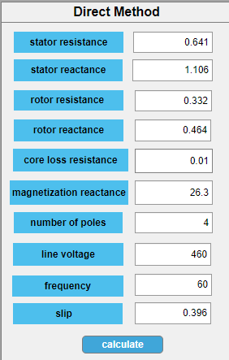

# -Induction-Motor-Characteristics-and-Performance-Analysis-Using-MATLAB
This is my Numerical Technique Laboratory Project . in this project, I developed a MATLAB Designer App application that estimates induction motor’s equivalent-circuit parameters from standard lab tests (DC, no-load, and locked-rotor) or direct inputs, then simulates performance across slip to plot torque–speed, power, loss, and efficiency curves and report starting torque, maximum (pull-out) torque, and maximum slip.

